# Welcome to Private Pilot License Test!

### This is my first commercial project, it's created for private pilots. In this app they can evaluate their theoretical knowledge.

---

## Let's begin!

### `Start`

This is "Welcome" section with little description.
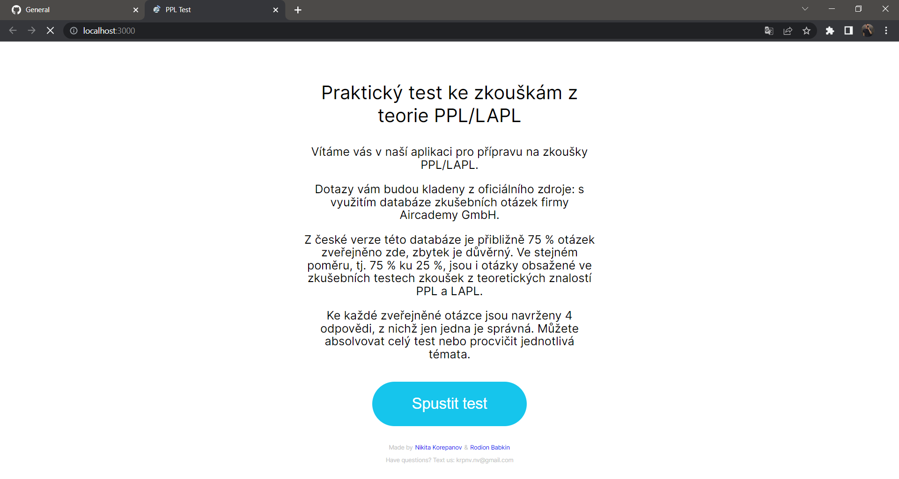

---

### `Options`

In this section the user needs to select options for his test.

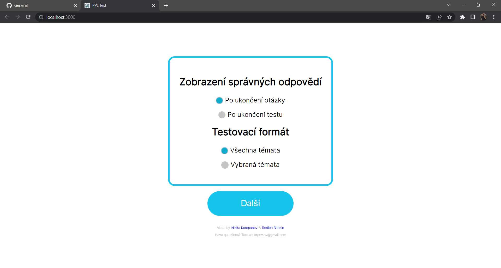

1. When will the answers be shown?
   - after answer
   - after test
2. Choose themes or work with all topics?
   - whole test
   - choose themes

For best example I choose "after answer" and "choose themes".

---

### `Themes list`

Now we choose topics what we need.

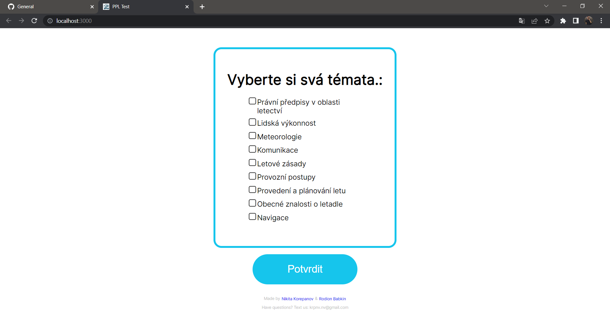
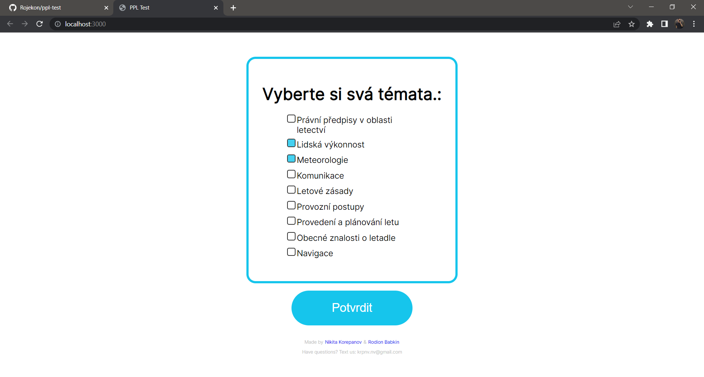

---

### `Preparation page`

On this page user is informed about selected options and the time given to pass test.

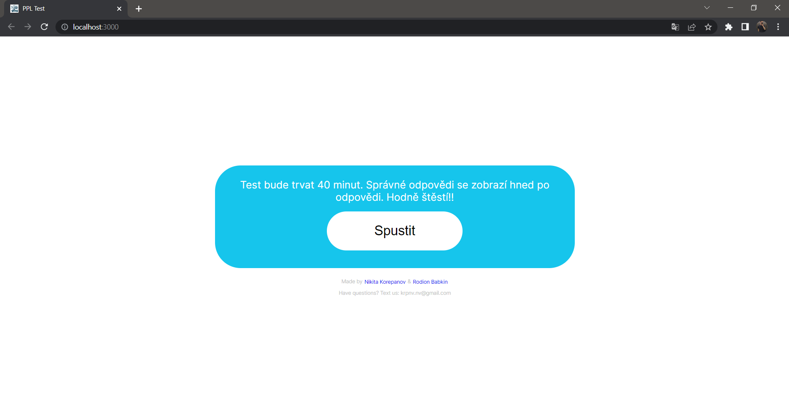

In our case: we have 40 minutes for all test and answers will be shown immediately after selection.

---

## Test beggining!

### `Typycal question page`

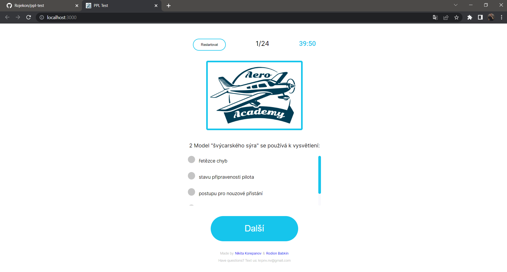

We got here:

- top section
- logo of academy
- question
- four answers with custom scrollbar
- "next" button

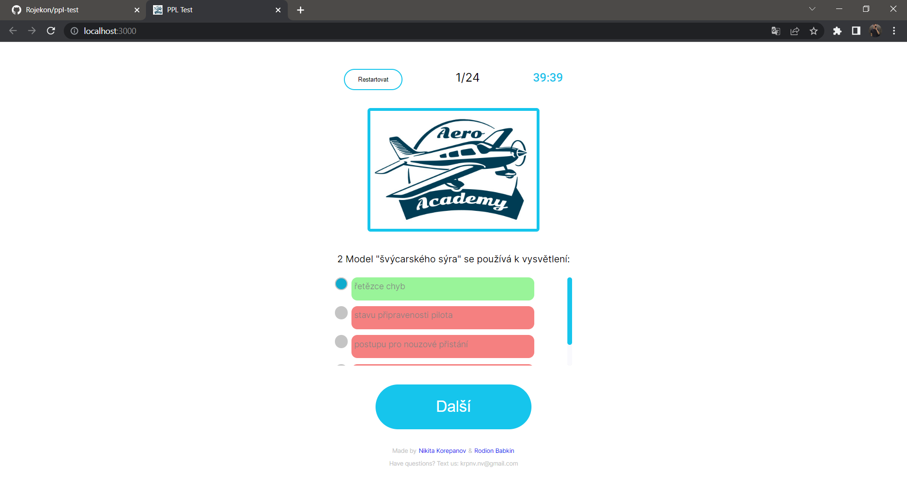

Same question, but answered.

---

### `This is what it looks like when answers are shown after test`

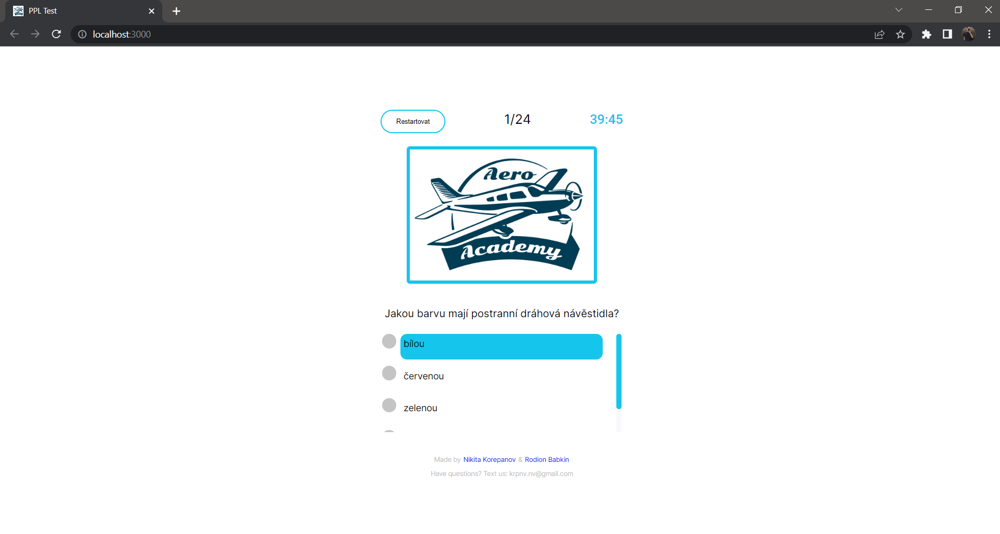

---

## Let's take a closer look!

### `Top section`

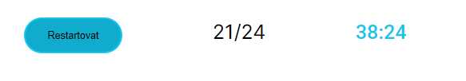

We can see here:

- "restart" button
- questions counter
- countdown timer

---

### `Logo or image section`

To answer some questions, the user needs to look at the image.

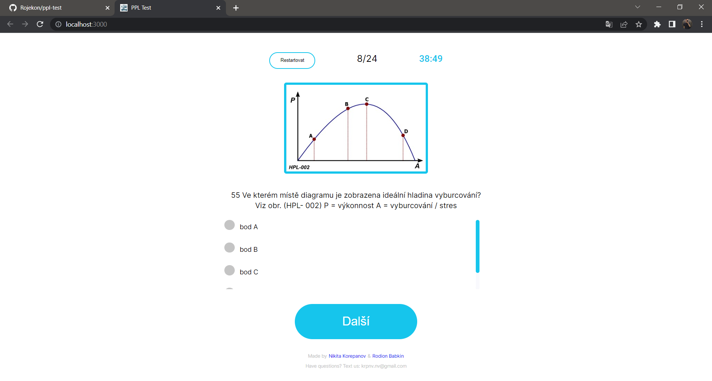

In some cases, the user can enlarge the image if they hover over it with mouse.

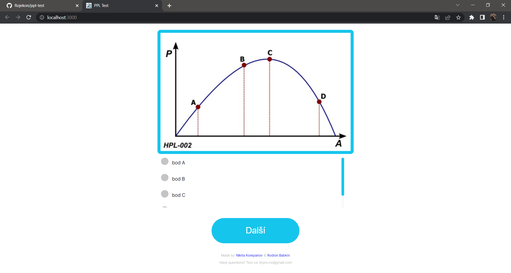

---

### `Score section`

When time is up or the user has solved the test, the score section is displayed.

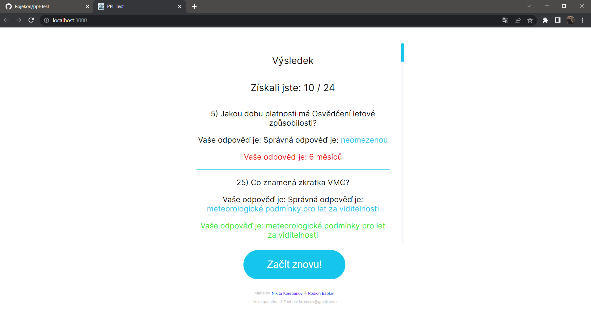

We can see the total score here.

And more detailed statistics.

For example: if user's answer is not correct, then it is colored red. 
It also works to other side: if the answer is correct - the color is green.

If the user wants to try again, he can click the "start over" button.

---

## Well, this was the introductory part with my first commertial project, now let's talk about all the experience that I got!

#### `In this project, I experienced the full power of React.   I can't imagine how much time it would take to write the same test but in vanilla JS. The best thing I liked to work with is React Hooks. They make development easier and faster.  `

#### `I learned how to work with props, pass from parent to child, from child to parent, from child to child.`

#### `It was the first project in which there are interactions with the backend.`

#### `The interesting part not only to develop, but also to stylize the whole project, making changes from the original style. Making it responsive and create custom elements.`

## Thanks for your attention! If you have any questions or job offers, write to me: <rodionbabkin00@gmail.com>
